# Azure AI Foundry - Architecture Diagram

## Network Architecture with Private Endpoints

```mermaid
graph TB
    subgraph Internet
        User[👤 User]
        DevTools[Development Tools Script]
    end

    subgraph Azure["Azure Subscription"]
        subgraph RG["Resource Group"]
            
            subgraph VNet["Virtual Network (10.10.0.0/16)"]
                
                subgraph BastionSubnet["AzureBastionSubnet (10.10.2.0/26)"]
                    Bastion[Azure Bastion<br/>Secure RDP Access]
                end
                
                subgraph WorkloadSubnet["Workload Subnet (10.10.1.0/24)"]
                    VM[Windows VM Jumpbox<br/>Windows Server 2025<br/>🔑 Managed Identity]
                    
                    subgraph PrivateEndpoints["Private Endpoints Zone"]
                        PE_Storage[PE: Storage]
                        PE_KV[PE: Key Vault]
                        PE_ACR[PE: ACR]
                        PE_AI[PE: AI Services]
                        PE_DocInt[PE: Doc Intelligence]
                        PE_Hub[PE: AI Hub]
                    end
                end
                
                NAT[NAT Gateway<br/>optional]
            end
            
            subgraph PrivateDNS["Private DNS Zones (11 zones)"]
                DNS_Blob[privatelink.blob...]
                DNS_File[privatelink.file...]
                DNS_Queue[privatelink.queue...]
                DNS_Table[privatelink.table...]
                DNS_Vault[privatelink.vaultcore...]
                DNS_ACR[privatelink.azurecr.io]
                DNS_Cog[privatelink.cognitiveservices...]
                DNS_OpenAI[privatelink.openai...]
                DNS_AIServices[privatelink.services.ai...]
                DNS_ML[privatelink.api.azureml.ms]
                DNS_Notebooks[privatelink.notebooks...]
            end
            
            subgraph DataPlane["Data & Storage Layer"]
                Storage[Storage Account<br/>🔒 No Shared Keys<br/>🔑 AAD Only]
                KV[Key Vault<br/>🔒 RBAC Only<br/>Secrets & Config]
                ACR[Container Registry<br/>Premium SKU<br/>Container Images]
            end
            
            subgraph AILayer["AI Services Layer"]
                CogServices[Azure AI Services<br/>Multi-Service Account<br/>🔑 Managed Identity]
                DocInt[Document Intelligence<br/>Form Recognition<br/>🔑 Managed Identity]
            end
            
            subgraph MLOps["AI Foundry / ML Platform"]
                Hub[AI Foundry Hub<br/>kind: Hub<br/>🔑 Managed Identity]
                Project[AI Foundry Project<br/>kind: Project<br/>🔑 Managed Identity]
            end
            
            subgraph Monitoring["Monitoring & Observability"]
                LogAnalytics[Log Analytics<br/>Workspace]
                AppInsights[Application Insights<br/>Telemetry]
            end
        end
    end

    %% User Access Flow
    User -->|HTTPS 443| Bastion
    Bastion -.->|RDP 3389| VM
    DevTools -.->|Install Script| VM

    %% VM to Private Endpoints
    VM -->|RBAC Auth| PE_Storage
    VM -->|RBAC Auth| PE_KV
    VM -->|RBAC Auth| PE_ACR
    VM -->|RBAC Auth| PE_AI
    VM -->|RBAC Auth| PE_DocInt
    VM -->|RBAC Auth| PE_Hub

    %% Private Endpoints to Services
    PE_Storage -.->|Private Link| Storage
    PE_KV -.->|Private Link| KV
    PE_ACR -.->|Private Link| ACR
    PE_AI -.->|Private Link| CogServices
    PE_DocInt -.->|Private Link| DocInt
    PE_Hub -.->|Private Link| Hub

    %% AI Hub Dependencies
    Hub -->|Uses| Storage
    Hub -->|Secrets| KV
    Hub -->|Containers| ACR
    Hub -->|Monitoring| AppInsights
    Hub -->|Connected Service| CogServices
    Project -->|Linked to| Hub

    %% Monitoring Connections
    Storage -.->|Logs| LogAnalytics
    KV -.->|Logs| LogAnalytics
    ACR -.->|Logs| LogAnalytics
    Hub -.->|Logs| LogAnalytics
    Project -.->|Logs| LogAnalytics
    AppInsights -->|Backend| LogAnalytics

    %% DNS Resolution
    PE_Storage -.->|DNS| DNS_Blob
    PE_Storage -.->|DNS| DNS_File
    PE_Storage -.->|DNS| DNS_Queue
    PE_Storage -.->|DNS| DNS_Table
    PE_KV -.->|DNS| DNS_Vault
    PE_ACR -.->|DNS| DNS_ACR
    PE_AI -.->|DNS| DNS_Cog
    PE_AI -.->|DNS| DNS_OpenAI
    PE_AI -.->|DNS| DNS_AIServices
    PE_Hub -.->|DNS| DNS_ML
    PE_Hub -.->|DNS| DNS_Notebooks
    PE_DocInt -.->|DNS| DNS_Cog

    %% NAT Gateway for outbound
    WorkloadSubnet -.->|Outbound| NAT
    NAT -.->|Stable IP| Internet

    style VNet fill:#e1f5ff,stroke:#0078d4,stroke-width:3px
    style WorkloadSubnet fill:#fff4e6,stroke:#ff8c00,stroke-width:2px
    style BastionSubnet fill:#ffe6e6,stroke:#d13438,stroke-width:2px
    style PrivateEndpoints fill:#e6ffe6,stroke:#107c10,stroke-width:2px
    style VM fill:#ffd700,stroke:#333,stroke-width:2px
    style Hub fill:#9370db,stroke:#333,stroke-width:3px
    style Project fill:#ba55d3,stroke:#333,stroke-width:2px
    style User fill:#ff69b4,stroke:#333,stroke-width:2px
```

## RBAC Roles & Permissions Flow

## Data Flow & Service Dependencies

## Security Boundaries

## Legend

- **Solid Lines (→)**: Direct resource dependencies or required connections
- **Dashed Lines (-.->)**: Network traffic flow or logging/monitoring
- **🔒**: Security-enforced boundaries
- **🔑**: Managed Identity / AAD Authentication
- **✅**: Enabled/Allowed
- **❌**: Disabled/Denied
- **🚫**: Explicitly blocked

## Key Security Features

1. **Zero Public Access**: All data plane resources disable public network access
2. **Private Endpoints**: All services accessible only within VNet
3. **AAD Authentication**: Shared keys and local auth disabled everywhere
4. **RBAC-Based**: All access controlled via Azure RBAC roles
5. **Network Isolation**: Complete network segmentation with NSGs
6. **Managed Identities**: All services use system-assigned identities
7. **Bastion-Only Access**: No public IPs on VMs, secure RDP via Bastion
8. **Private DNS**: All private endpoint resolution within VNet
9. **Monitoring**: Centralized logging to Log Analytics
10. **Least Privilege**: Fine-grained RBAC role assignments
